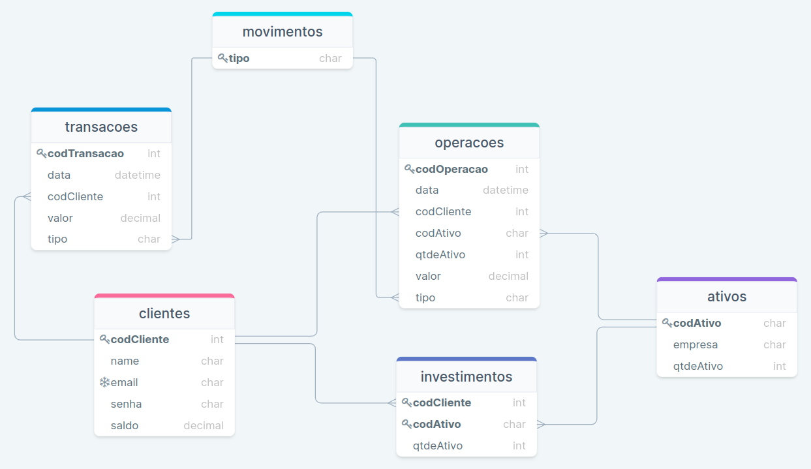
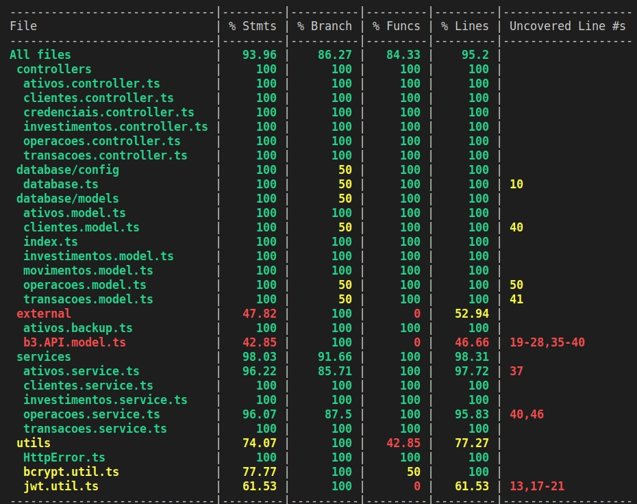

# **YOUR BROKER API**   :bank: :chart_with_upwards_trend:

### **Resumo**

Esta é uma API REST que simula o funcionamento de uma corretora de investimentos, proposta pelo case técnico para o processo seletivo da XP Inc., direcionado aos alunos da Turma XP/Trybe.

Utilizando o protocolo HTTP, a API possui sistema de autenticação JWT, permitindo aos usuários se cadastrarem e realizarem login, além de realizarem operações específicas sobre seus ativos e contas da corretora.

A API foi construída utilizando `Node.js` e o framework `Express`, a partir de `TypeScript`. A arquitetura escolhida foi a de MSC (Model, Service e Controller), gerando um código organizado e desacoplado. A aplicação foi desenvolvida e testada utilizando bancos de dados `MySql` e `PostgreSQL`, por meio do ORM `Sequelize`.

Testes unitários automatizados foram desenvolvidos utilizando os frameworks `Mocha`, `Chai` e `Sinon`, e são verificados em qualquer Pull Request aberto no atual repositório, através de GitHub Actions. Além desta ação, no mesmo momento há também a verificação de estilização do código, utilizando o `Eslint` com predefinições extendidas do padrão *airbnb-base*.

Foi realizada a documentação da API utilizando o `Swagger UI` e as especificações do `OpenAPI 3.0.0` .

Todo o desenvolvimento do código foi feito utilizando o `Docker` para garantir um ambiente desenvolvimento homogêneo. Além disso, o deployment, feito na plataforma `Heroku`, também utilizou de containerização, carregando para o ambiente de produção a homogeneização citada anteriormente.

> [Documentação Técnica da API em Produção](https://your-broker.herokuapp.com/docs)

> [Aplicação Front-end para apresentação das funcionalidades básicas da API](https://your-broker-front.herokuapp.com/) e seu [repositório GitHub](https://github.com/leobmend/your-broker-front)
---

## **MODELAGEM DO BANCO DE DADOS**   :open_file_folder:

O diagrama de entidade-relacionamento foi idealizado pensando na melhor representação das entidades presentes em uma plataforma de investimentos de uma corretora. Além disso, levou-se em conta pontos para suprir possíveis e óbvias necessidades de um front-end que consome tais informações quando o assunto é o setor financeiro e o uso deste por um cliente.

As entidades principais em ação aqui são os `Clientes` e os `Ativos`. As outras tabelas surgem dos relacionamentos destas e, para melhor entendimento, alguns pontos importantes:

- `Transações`: São as movimentações financeiras que os clientes realizam, podendo ser do tipo `deposito` ou `saque`. Carregam as informações básicas para o front-end apresentar a lista de transações realizadas pelo cliente, situação comum quando o cliente quer analisar seu histórico de saques e depósitos.

- `Operações`: São as movimentações de ativos que os clientes realizam, podendo ser do tipo `compra` ou `venda`. Carrega as informações básicas para o front-end apresentar a lista de operações realizadas pelo cliente, situação comum quando o cliente precisa verificar seu histórico de compra e venda de ativos assim como calcular o preço médio de compra de um ativo que possui em sua carteira de investimentos.

- `Investimentos`: São a relação de ativos que os clientes possuem atualmente. Carrega a informação de quantidade atual para o front-end apresentar ao cliente, por exemplo, a sua carteira de investimentos.

- `Movimentos`: Tabela unicamente para definição fixa dos tipos de movimentos, atrelando os valores possíveis à *primary key* desta. Em `Operações` temos `compra` e `venda`, e em `Transações` temos `deposito` e `saque`. 

A tabela de `Ativos` foi populada no momento da migração do ORM `Sequelize`, utilizando a lista de empresas monitoradas pela API como referência para os códigos e nomes dos ativos. E a aplicação, na versão atual, não prevê alteração destes. 

O campo de `qtdeAtivo` (quantidade de ativos disponíveis para a compra) é populado inicialmente de forma aleatória, respeitando um máximo definido arbitrariamente como 1.000.000 (um milhão).

A ausência do campo `valor` nas tabelas de `Ativos` e `Investimentos` é um ponto importante da modelagem. Embora contra intuitivo, essa ausência ocorreu pois o entendimento foi de que o valor precisa ser verificado exatamente no momento da requisição, para depois ser então apresentado ao front-end e cliente. 

Assim, não faz sentido armazenar este dado, mas sim consumí-lo de uma API externa entre o momento de requisição e a devida resposta com todas as informações, inclusive o valor. Já em `Operações`, o campo `valor` é o registro do valor no momento da compra ou venda, informação importante para registro.

---

## **API EXTERNA**   :globe_with_meridians:

Como sinalizado anteriormente, o valor dos ativos apresenta o desafio de ser apresentado atualizado. Para isso, tentando equilibrar usabilidade e veracidade das informações, foi escolhido a [API-Cotacao-B3](https://api-cotacao-b3.labdo.it/), construída e mantida pelo [LABDO.IT](https://labdo.it), para fins não comerciais.

Ela apresenta documentação autoexplicativa e sua base de informações é sólida, pois essa é obtida diretamente das bolsas de valores dos ativos que realiza o monitoramento. No entando, ela apresenta os dados das cotações dos ativos com um delay usual de 1 dia útil. Como valor da cotação a ser utilizado, foi escolhido o valor do fechamento do pregão. Assim, dentre as possibilidades, mantém-se a maior autenticidade da informação.

Para consumir as informações da API, foi utilizado a biblioteca `Axios`, realizando requisições do tipo `GET` e tratando o resultado conforme necessário. 

Devido a não ser uma API para fins comerciais, ocorre em alguns momentos de grande tráfego, a falha das requisições retornando um código 429 (*too many requests*). Logo, como medida paleativa para não parasilar a API nestes momentos, foi optado pela definição de um *timeout* de 7500 (sete mil e quinhetos) milisegundos nas requisições. E, caso esse tempo seja atingido, é utilizado arbitrariamente como valor da cotação um valor decimal (2 casas) entre R$3,00 e R$21,00.

Como ponto de melhoria futura, é necessário analisar outras opções de APIs para consumir tal informação.

---

## **DOCUMENTAÇÂO SWAGGER**   :page_with_curl:

Para detalhamento técnico maior, exemplos de requisições e respostas da API, a documentação utilizando `Swagger` está [presente aqui](https://your-broker.herokuapp.com/docs)! Na seção próxima à esta, há uma descrição mais qualitativa e pensando na jornada do cliente.

Infelizmente, devido ao deploy na plataforma `Heroku` em modalidade *free*, a primeira requisição pode falhar devido ao estado de hibernação do servidor. Portanto, favor recarregar a página caso ocorra. 

---

## **FUNCIONALIDADES E ROTAS**   :wrench:

### **Credenciais**

Os usuários, aqui chamados de clientes, podem acessar a rota `POST /credenciais/cadastrar/` para realizar seu cadastro, informando `nome`, `email` e `senha`. 

Verificações são realizadas para garantir que não haja caracteres indesejados no nome do cliente e também se trata-se de um e-mail válido para um novo cadastro. Se todas as validações forem bem sucedidas, o cadastro é feito e um `token` JWT é retornado ao cliente para autenticação nas demais rotas quando necessário.

Clientes já cadastrados podem seguir diretamente para a rota `POST /credenciais/entrar/`, passando no corpo da requisição as informações de `email` e `senha`.

A validação das credenciais é realizada e, caso haja sucesso, um `token` JWT é retornado ao cliente como na rota de cadastro.

> Obs1: O *pattern regex* utilizado para verificação de e-mail válido foi o seguinte: `/\w+([.]\w+)*@\w+([.]\w+)+/i`. Já para a identificação de caracteres especiais no nome e sanitização, foi utilizado o seguinte: `/[^a-zA-Z áéíóúã]/g`. Além disso, aplicou-se o método `.trim()` no nome do cliente. 

> Obs2: A senha do cliente, recebida em *plain text* pela API, não é salva diretamente no banco. Utilizando de criptografia `bcrypt` para codificá-la, antes do devido registro.

### **Ativos**

Os ativos podem ser checados acessando tanto a rota `GET /ativos` (para uma busca personalizada pela lista de ativos), quanto a rota `GET /ativos/{codAtivo}` (para um ativo em específico a partir de seu código).

Na primeira opção, o retorno sempre será uma lista de ativos encontrados. Para minimizar a possibilidade de erros *429 (too many requests)* da API externa, foi decidido pela limitação da lista para até no máximo 10 ativos por requisição. A paginação desejada e a busca personalizada podem ser requisitadas utilizando os seguintes parâmetros por *query string* na url:

- `termo`: Parâmetro em tipo `string`, a ser pesquisado por correspondências tanto no campo `codAtivo` (código do ativo), quanto no campo `empresa` (nome registrado da empresa). Se não informado ou vazio, resulta na lista original.
- `pag`: Parâmetro em tipo `integer`, indica a página de ativos a ser apresentada, com máximo de 10 ativos por requisição.
- `ordenacao`: Parâmetro e *feature* a serem implementados em futuras versões.

> Obs: Reforçando, todos os dois endpoints realizam a checagem do valor dos ativos (ou ativo) no momento da requisição, consumindo da API externa.

### **Clientes**

Para buscar as informações específicas do cliente, é possível utilizar a rota `GET /clientes/{codCliente}`. A resposta conterá as informações do cliente, exceto a senha (cadastrada encriptada no banco de dados). 

Assim, o front-end pode acessar informações para criar uma página de perfil contendo o saldo atual do cliente e suas informações básicas.

Na requisição desta rota, é necessário que o *header* possua o token JWT em *bearer format*. Além da autenticação do token verificando sua expiração e validade, também é feito a checagem chamada de **autorização do cliente**. Nessa checagem é permitido o prosseguimento da requisição para resposta se, e somente se, o parâmetro `codCliente` proveniente da url for idêntico ao existente dentro do *payload* do token. Evitando que um cliente visualize informações de outro cliente.

Caso seja necessário a edição das informações do cliente, a rota `PUT /clientes/{codCliente}` pode ser utilizada. Ela recebe no mínimo um dos três parâmetros a seguir pelo corpo da requisição: *nome*, *email* e *senha*. Após validações dos valores informados, é feita a atualização e retornado as informações completas atualizadas do cliente.

### **Transações**

Os clientes são, naturalmente, cadastrados obrigatoriamente com o saldo zerado. Para iniciar a interação com outras funções, invariavelmente será necessário um depósito. Portanto, através da rota `POST /clientes/{codCliente}/transacoes` e utilizando o campo `tipo` como `deposito` no corpo da requisição, é possível aumentar o saldo do cliente.

Analogamente, utilizando o campo `tipo` como `saque`, realiza-se a movimentação inversa, caso o `saldo` do cliente seja suficiente.

Além disso, com a rota `GET /clientes/{codCliente}/transacoes`, o front-end pode acessar as transações do cliente e construir uma interface de histórico de movimentações financeiras da sua conta.

A verificação de **autorização do cliente** também ocorre aqui, impedindo que um cliente visualize as transações de outro cliente ou registre transações em nome de outro cliente.

> Obs: Um middleware de validação do corpo da requisição verifica os tipos dos campos e impede, por exemplo, valores negativos de transações.

### **Investimentos**

Para buscar os investimentos atuais de um cliente, é possivel utilizar a rota `GET /clientes/{codCliente}/investimentos`. A resposta conterá a listagem de investimentos para aquele cliente, com a quantidade de ativos em posse e o valor unitário no momento da requisição.

Essa é uma rota ideal para que o front-end consiga construir uma página de carteira de investimentos, listando valores totais por ativos e/ou valores totais.

A verificação de **autorização do cliente** também ocorre aqui para impedir que um cliente visualize os investimentos de outro cliente.

### **Operações**

Com o saldo positivo, o cliente pode de fato iniciar o uso da corretora. E, com a rota `POST /clientes/{codCliente}/transacoes`, é possível realizar as operações de `compra` ou `venda`, utilizando novamente o campo `tipo` no corpo da requisição para sinalização da movimentação em questão. 

Após resgatar o valor atual da cotação do ativo utilizando a API externa, são feitas algumas verificações. 
- A operação de compra de ativo só é consolidada caso o estoque do ativo na corretora (`qtdeAtivo` na tabela `Ativos`) seja suficiente e se o saldo do cliente seja suficiente para atender o valor total da operação (valor do ativo multiplicado pela quantidade de ativos).
- A operação de venda de ativo só é consolidada caso o estoque do ativo nos investimentos do cliente seja suficiente.

Se a validação referente a cada caso for bem sucedida, a operação é registrada normalmente e as tabelas de `Clientes`, `Ativos` e `Investimentos` são atualizadas apropriadamente.

Além disso, com a rota `GET /clientes/{codCliente}/operacoes`, o front-end pode acessar as operações do cliente e construir uma interface de histórico de movimentações de ativos da sua carteira de investimentos.

A verificação de **autorização do cliente** também ocorre aqui, impedindo que um cliente visualize as operações de outro cliente ou registre operações em nome de outro cliente.

> Obs: Um middleware de validação do corpo da requisição verifica os tipos dos campos e impede, por exemplo, valores negativos de quantidade de ativos.

---

## **TESTES UNITÁRIOS**   :mechanical_arm:

Os testes unitários automatizados foram aplicados ao código para garantir o funcionamento como desejado e manter sua coesão durante manutenções futuras. As bibliotecas utilizadas foram: `mocha`, `chai`, `sinon` e `chai-as-promised`.

Para verificação da cobertura dos testes, foi utilizado a blibioteca `nyc`, e atingiu-se a marca de 95% de cobertura.

---

## **DESENVOLVIMENTO**  :computer:

Todo o desenvolvimento foi realizado utilizando um ambiente conteinerizado com `Docker`. Na pasta raiz do projeto está presente o arquivo `docker-compose.yml`, responsável por orquestrar a subida de:

 - `db-your-broker`: Container `mysql:8.0.21`, como banco de dados de desenvolvimento.
 - `node-your-broker`: Container personalizado com base no `node:16-alpine`, como servidor de desenvolvimento para funcionamento do `Express`.

Assim, basta utilizar o comando `docker-compose up -d` para subir o ambiente e, após se acoplar ao container `node-your-broker`, iniciar o desenvolvimento. 

As variáveis de ambiente já estão configuradas para funcionamento automático com este procedimento. Porém, caso seja de interesse, há o arquivo `.env.example` para demonstrar as variáveis de ambiente necessárias para o funcionamento da aplicação corretamente.

### **Scripts**

Lista de scripts para desenvolvimento e gerenciamento da aplicação:

* `npm db:re-migrate`: Compila o código `TypeScript` e realiza o processo de recriação de todas as tabelas do banco de dados, populando novamente logo em seguida.
* `npm db:reset`: Realiza o mesmo que o comando anterior, porém no percurso exclui a *database* por completo.
* `npm run lint`: Realiza a verificação de estilização do `eslint`.
* `npm test`: Roda os testes automatizados presentes na pasta `./tests`.
* `npm run test:coverage`: Roda os testes automatizados e cria a tabela de cobertura destes.
* `npm run dev`: Roda a aplicação em constante observação quanto a alteração de algum dos arquivos, reinicializando caso ocorra. Ideal durante o desenvolvimento.
* `npm start`: Compila o código `TypeScript` e inicializa a aplicação. Scrip utilizado para subir a aplicação em produção.

### **Continuos Integration**

Utilizando as [*GitHub Actions*](https://docs.github.com/pt/actions), está aplicado automaticamente à qualquer nova *Pull Request*, tanto a verificação de estilização do `Eslint` quanto a verificação de atendimento aos testes unitários. Não permitindo assim o *merge* de código sem a devida padronização ou com bugs evitáveis.

---

## **DEPLOYMENT NO HEROKU**   :earth_americas:

O deployment da aplicação foi realizado utilizando a plataforma `Heroku`. Para tal, utilizou-se a *stack* de `containers` da plataforma, permitindo assim a definição e uso do `Dockerfile` a ser realizado o *build* de nossa aplicação.

As informações sensíveis e definições de acesso ao banco de dados de produção foram definidas como variáveis de ambiente do container utilizado pelo Heroku (chamadas na plataforma de *config vars*).

O banco de dados selecionado para o *deployment* foi o `PostgreSQL`, através da plataforma `Supabase`. A seleção foi devido à facilidade de uso da plataforma e considerável performance utilizando o servidor da América do Sul (São Paulo, capital).

Devido ao *deployment* em modalidade *free*, o `Heroku` realiza o chamado *idling*, ou hibernação em tradução livre. Assim, após um período de inatividade da aplicação (sem requisições), ela é colocada neste estado hibernativo. A próxima requisição feita terá que aguardar a inicialização do serviço novamente. Causando um * delay* que, normalmente, é curto e quase imperceptível. Porém, em testes próprios ao longo do desenvolvimento, esse delay causou *crashs* e necessitou o recarregamento do navegador ou do `Postman`.

Pode ser acessado [aqui](https://your-broker.herokuapp.com/docs/)!

---

## **CASE TÉCNICO XP**   :office:

### **Considerações**

Durante minha leitura do case proposto e também ao longo do desenvolvimente, senti a necessidade de realizar adições e alterações à estrutura de rotas e aos corpos das requisições propostas. As mudanças tiveram como pilares:

- Maior facilidade de entendimento da estrutura de rotas.
- Maior compatibilidade entre os corpos das requisições e a modelagem do banco de dados.
- Limitações da API externa utilizada.
- Necessidades básicas de um possível front-end usuário da API.

As modificações em relação ao proposto foram as seguintes:

1. Alterado o tipo do `codAtivo` para `string`, utilizando o ticker do ativo (único para cada um) como *primary key* no banco de dados.

2. Alterado a forma de envio do `codCliente`, nas rotas onde se faz necessário, para que seja como parâmetro da url .

3. Rota proposta: `GET /conta/{codCliente}`
    * Rota utilizada: `GET /clientes/{codCliente}`
    * Retorno de dados com os campos adicionais `nome` e `email`, ambos do tipo `string`.

4. Rota proposta: `GET /ativos/{codAtivo}`
    * Rota mantida.
    * Retorno de dados com o campo adicional `empresa`, do tipo `string`, contendo o nome da empresa emitidora do ativo.

5. Rotas propostas: `POST /investimentos/comprar` e `POST /investimentos/vender`
    * Rota utilizada: `POST /clientes/{codCliente}/operacoes`.
    * Adicionado o campo `tipo` (como compra ou venda) para informar o tipo da operação.

6. Rotas propostas: `POST /conta/deposito` e `POST /conta/saque`.
    * Rota utilizada: `POST /clientes/{codCliente}/transacoes`.
    * Adicionado o campo `tipo` (como deposito ou saque) para informar o tipo da transação.

7. Rota proposta: `GET /ativos/{codCliente}`
    * Rota utilizada: `GET /clientes/{codCliente}/investimentos`.

### **Desafios**

Acredito que as decisões que tomei quanto às tecnologias a serem utilizadas me tiraram completamente da minha zona de conforto, e daí surgiram os desafios.

Portanto, os principais desafios foram:

* Utilizar pela primeira vez `TypeScript` com o `Sequelize`.
* Primeiro contato com o tópico e criação da documentação de uma API. Consequentemente, primeiro contato com a ferramenta `Swagger`.

Além disso, o planejamento para cumprir o prazo, entregando todas as ferramentas que desejava, foi um grande desafio.

---

## **TECNOLOGIAS** :zap:

A seguir, a lista completa de tecnologias utilizadas com suas respectivas documentações:

* Geral
  * [TypeScript](https://www.typescriptlang.org/docs/)
  * [Node.js](https://nodejs.org/en/docs/)
  * [Express](https://expressjs.com/pt-br/starter/installing.html)
  * [Axios](https://axios-http.com/docs/intro)
  * [Eslint](https://eslint.org/docs/latest/user-guide/getting-started)
* Banco de Dados
  * [Sequelize](https://sequelize.org/docs/v6/getting-started/)
  * [PostgreSQL](https://www.postgresql.org/docs)
  * [MySQL](https://dev.mysql.com/doc/)
* Deployment
  * [Heroku](https://devcenter.heroku.com/categories/reference)
  * [Docker](https://docs.docker.com/)
  * [Supabase](https://supabase.com/docs)
* Documentação
  * [Swagger](https://swagger.io/docs/)
* Testes
  * [Mocha](https://mochajs.org/)
  * [Chai](https://www.chaijs.com/api/)
  * [Sinon](https://sinonjs.org/releases/latest/)
* Segurança e validação
  * [Joi](https://joi.dev/api/)
  * [JWT](https://jwt.io/introduction)
  * [bcrypt](https://www.npmjs.com/package/bcrypt)

---

## **CONTATOS** :speech_balloon:

Para qualquer dúvida, critica, sugestão ou comentário, por favor entre em contato!

[Meu portfólio](https://leobmend.github.io) contêm esse e outros projetos de desenvolvimento web, fique à vontade para conferir!

 
